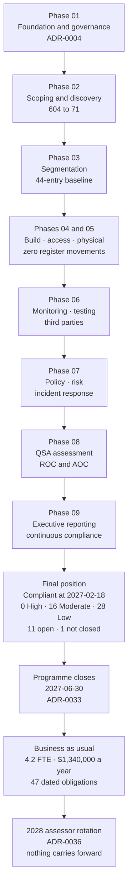

# 09.14 — Programme Closure

| Field | Value |
|---|---|
| Document ID | MRG-PCI-2026-914 |
| Program | Marketa Retail Group — PCI DSS v4.0.1 Compliance Program |
| Phase | 09 — Executive Reporting &amp; Continuous Compliance |
| Document | 09.14 — Programme Closure |
| Version | 1.0 |
| Status | Approved |
| Owner | Naomi Bhatt, Chief Information Security Officer |
| Approver | Raymond Voss, Chief Financial Officer |
| Date | 2026-07-15 |
| Classification | Confidential — Cardholder Data Environment // Illustrative Portfolio Sample |

## Purpose

This document closes the Marketa Retail Group PCI DSS v4.0.1 compliance programme.

It is not a phase summary. Eight of those have been written, each answering what its phase inherited and handing forward what the next one had to do. **This one has nothing to hand forward except an operating organisation**, and its subject is therefore the whole of it: what the nine phases delivered, what the position actually is on **2027-06-30**, what remains open and why, the assurance statement in full, the legal framing restated because it is the frame everything else sits inside, and a final paragraph that has to earn eighteen months of documents.

It closes, as the last four phase summaries have, with the uncomfortable things stated in plain terms — because the alternative is a closure report that reads better than the programme it closes, and because **three of the most valuable artefacts this programme produced are a filing that says Marketa did not meet two requirements, a register that closes three entries worse than forecast, and an open item that never closed because a provider said no.**

## 1. What the Programme Committed To

The charter of **2026-01-12** set six objectives and one principle. Each is answered here without adjustment.

| # | Commitment | Source | Outcome |
|---|---|---|---|
| **1** | **Validate as a Level 1 merchant against PCI DSS v4.0.1** by on-site assessment producing a Report on Compliance and an Attestation of Compliance | Charter §2; **C2** | **Delivered, twice.** ROC and AOC issued **2026-12-11**, **Non-Compliant** on two of 306 sub-requirements. Revised ROC and AOC issued **2027-02-18** following re-assessment: **In Place 299 · CCW 3 · N/A 4 · Not Tested 0 · Not in Place 0 — Compliant** |
| **2** | **Reduce the assessed scope to what the payment channels actually require**, and evidence the reduction | Charter §2; Phase 02 | **Delivered. 604 believed in scope → 71 assessed components, −88.2%**, through P2PE, tokenization and DTMF masking. **1,842 of 1,842 systems scanned for PAN**, plus 41 network shares and 6 email archives |
| **3** | **Continuous compliance, evidenced annually** — not a demonstration staged for November | Charter §3, the second principle | **Delivered and measurable. 186 of 214 assessor evidence requests (86.9%) satisfied from artefacts that already existed**, 0 unsatisfied. The principle is operationalised for business as usual in **09.09** and **09.10** |
| **4** | **A risk register that describes exposure, moves on evidence, and is reported against a published forecast** | Charter §4; 03.10; 03.11 | **Delivered, and the forecast was missed. 44 entries throughout; 0 High · 16 Moderate · 28 Low at close against a published forecast of 0 · 13 · 31.** Three short, reconciled entry by entry in **09.12 §2** |
| **5** | **No accommodation is presented as a treatment, and no High risk is accepted** | Charter §4; ADR-0005; 03.10 §5 | **Delivered. Nine High entries entered the programme and every one left by treatment.** The CFO acceptance route exists, carries an expiry date, and **was never used** |
| **6** | **Evidence that would survive a forensic investigator's review two years from now**, not evidence an assessor would accept in November | Charter §5 | **Delivered and tested in production.** The September Critical's 176-day exposure window was answered by **a complete enumeration of 47 sessions**, not by a search that found nothing |
| **7** | **A programme that ends**, with the recurring obligations owned by the operating organisation | Charter §6 | **Delivered. ADR-0033**; close **2027-06-30**; **47 dated obligations, each with a named owner**; the Payment Card Compliance Manager role made permanent |

## 2. What the Nine Phases Delivered

| Phase | Subject | The thing it produced that the programme could not have done without |
|---|---|---|
| **01** | Program Foundation &amp; PCI Governance | The operating model, the acquirer obligations **C1 to C10**, the compliance calendar, and **ADR-0004** — which removed the Not Tested disposition **ten months before anybody knew which requirements would be uncomfortable** |
| **02** | CDE Scoping &amp; Cardholder Data Discovery | **604 → 71.** PAN discovery across the whole estate, **four unexpected PAN locations**, and the assumption tests that raised **R-31** two days after the disproof, while remediation was still running |
| **03** | Network Segmentation &amp; Architecture | Nine zones, 31 named flows, the drift assertions **DA-1 to DA-6**, the first segmentation penetration test that **failed**, and the **44-entry baseline register** with its published close forecast |
| **04** | Build &amp; Maintain Secure Systems | Six baselines across the 71, the configuration assertions **CA-1 to CA-6**, the script control at **6.4.3**, and **ADR-0012** — measure deployed state, not documents |
| **05** | Access Control &amp; Physical Security | Multi-factor authentication on every path into the cardholder data environment, the privileged access model, the **8.3.9 customized approach**, the POI inspection programme across 1,914 terminals, and **the first refused compensating control** |
| **06** | Monitoring, Testing &amp; Third Parties | Automated log review with an accounted-for output, **CSC-1 to CSC-10** and 21 recorded control failures, **11.6.1** tamper detection, the penetration tests that found the **176-day interface**, and **the second refused compensating control** |
| **07** | Security Policy, Risk &amp; Incident Response | The policy suite, the **14 targeted risk analyses** consolidated with owners and staggered review dates, the annual scope confirmation, and **TT-2026-01** — the tabletop that disproved a load-bearing assumption |
| **08** | QSA Assessment &amp; ROC Production | Fifteen business days of fieldwork, **1,654 indexed evidence artefacts**, a **741-page** Report on Compliance, a **Non-Compliant** attestation filed twenty days early, and a re-assessment achieving full compliance |
| **09** | Executive Reporting &amp; Continuous Compliance | The Board and Audit Committee reporting, the metrics catalogue, the 2027–28 calendar, the business-as-usual transition, **the final register with the forecast reconciled**, and this closure |

## 3. The Programme in Numbers

| Measure | Value |
|---|---|
| **Duration** | **2026-01-12 to 2027-06-30 — 17.6 months** |
| Stores, lanes, terminals | **482 stores across 38 states · 1,914 POS lanes · 1,914 POI terminals** |
| People | **~34,000**, plus **+6,800** seasonal from October to January |
| Revenue and transactions | **$4.2B** · **68.4M** card transactions annually |
| **Systems in the estate** | **1,842** |
| **Believed in scope at start** | **604** |
| **Assessed system components** | **71** — 8 cardholder data environment, 63 connected-to |
| **Scope reduction** | **604 → 71, −88.2%** |
| **Applicable sub-requirements** | **306** |
| **2026 result** | **In Place 297 · CCW 3 · N/A 4 · Not Tested 0 · Not in Place 2 — Non-Compliant** |
| **2027 re-assessment result** | **In Place 299 · CCW 3 · N/A 4 · Not Tested 0 · Not in Place 0 — Compliant** |
| Compensating controls | **3** — CCW-01 (8.3.6), CCW-02 (2.2.7), CCW-03 (3.4.2). **2 refused** |
| Customized approaches | **1 — 8.3.9**, at **51 assessor hours against 46 estimated** |
| Not Applicable determinations | **4 — 1.5.1, 3.3.2, 3.5.1.1, 4.2.1.2**, from **7 exclusions proposed** and **3 refused** |
| Targeted risk analyses | **14**, with **4 trigger sets that fired** in the operating period |
| **Evidence** | **1,654 indexed artefacts · 214 requests · 186 (86.9%) from existing artefacts · 0 unsatisfied** |
| Fieldwork | **2026-11-02 → 2026-11-20**, 15 business days, 47 interviews across 39 individuals, 61 observations, **34 independent assessor testing actions** |
| Report on Compliance | **741 pages · 1,654 evidence references**; **31 factual review comments, 24 accepted, 7 declined** |
| Penetration testing | Segmentation and application testing. **19 findings — 2 Critical, 5 High, 7 Medium, 5 Low.** First segmentation test **failed**; re-tested clean |
| ASV scanning | **4 quarterly scans.** Q1 failed with 3 findings and was rescanned clean in 11 days; Q2–Q4 passed first time |
| Payment pages | **6 templates · 38 scripts · 11 third-party · 3 unauthorised at first inventory**; **214 tamper alerts**, median 9 minutes, 0 exceeding the 24-hour ceiling |
| Critical security control failures | **21** under 10.7.2, **9 of them invisible to the failing system's own health reporting** |
| Incidents | **512 records · 5 SEV-2 · 0 SEV-1 · no confirmed compromise of account data** |
| Awareness | **97.1%** completion against a **95%** charter bar |
| Internal audit | Rosa Delgado — **7 recommendations, 0 Critical** |
| **Risk register** | **44 entries throughout. 9 High · 21 Moderate · 14 Low → 0 High · 16 Moderate · 28 Low** |
| Impact reductions | **7 in the whole programme**, all named — R-10, R-14, R-31, R-23, R-08, R-18, R-32 |
| **Open items at close** | **11 entering Phase 09 — 8 closed on or before date, 2 closed late, 1 not closed** |
| Architecture decisions | **ADR-0001 to ADR-0036** |
| **Cost** | **$4,588,000 actual against a $4,600,000 budget — $12,000 under** |
| Resourcing | **11.4 FTE planned · 11.9 average · 12.7 at peak (October 2026) · 4.2 in business as usual** |

## 4. The Complete Final Position

### 4.1 Validation

| Element | Position at 2027-06-30 |
|---|---|
| Standard | **PCI DSS v4.0.1** — Marketa's **first** assessment with all 51 future-dated requirements in force |
| Merchant level | **Level 1**, on transaction volume for both Visa and Mastercard |
| Acquirer | **Cardinal Merchant Bank, N.A.** |
| Assessor | **Sable Ridge Assurance, LLC**; lead QSA **Grant Whitfield**, QSA **Amara Osei** |
| **2026 attestation** | **Non-Compliant**, signed **2026-12-11** by **Raymond Voss** under **ADR-0002**, filed the same day — **twenty days early**. Acknowledged by Cardinal **2026-12-16** with monthly remediation reporting required |
| **2027 attestation** | **Compliant**, issued **2027-02-18** after re-testing **16 sub-requirements** — the two findings and 14 related |
| **Both filed. Neither withdrawn** | **ADR-0032.** The revised attestation is additive |
| Quarterly ASV attestations | All four submitted to Cardinal within 30 days of quarter end under **C4** |
| Next validation | **CAL-45** — fieldwork 2027-11-01 to 2027-11-19; AOC to Cardinal by 2027-12-31 |

### 4.2 The requirement position

| Req | Applicable | In Place | CCW | N/A | Not in Place | Note at close |
|---|---|---|---|---|---|---|
| **1** | 26 | 25 | 0 | **1** | 0 | **1.5.1** Not Applicable, tested by netflow review and nine-zone egress inspection |
| **2** | 16 | 15 | **1** | 0 | 0 | **2.2.7 by CCW-02** on nine vendor-locked appliances |
| **3** | 28 | 25 | **1** | **2** | 0 | **3.4.2 by CCW-03**; **3.3.2** and **3.5.1.1** Not Applicable |
| **4** | 10 | 9 | 0 | **1** | 0 | **4.2.1.2** Not Applicable — POI terminals wired, store wireless a separate zone |
| **5** | 21 | **21** | 0 | 0 | 0 | Includes **5.3.3**, proposed as N/A, **refused**, assessed In Place on the EDR device-control module |
| **6** | 36 | **36** | 0 | 0 | 0 | **6.4.2** operative; **6.4.1 superseded**. 6.4.3 preventive, 11.6.1 detective |
| **7** | 17 | **17** | 0 | 0 | 0 | Least privilege across 24 role definitions |
| **8** | 46 | **46** | **1** | 0 | **0** | **8.3.6 by CCW-01**; **8.3.9 In Place via the customized approach**; **8.6.2 remediated 2027-01-29** |
| **9** | 31 | **31** | 0 | 0 | 0 | 1,914 terminals, quarterly inspection, 96 observed by the assessor across 28 stores |
| **10** | 31 | **31** | 0 | 0 | 0 | Includes **10.4.2** at monthly on 11 components; the assessor tested the analysis, not the conclusion |
| **11** | 23 | **23** | 0 | 0 | **0** | **11.3.1.2 remediated 2027-01-30.** 11.4.6 and 11.5.1.1 were never in the 306 |
| **12** | 21 | **21** | 0 | 0 | 0 | 12.4.1, 12.4.2, 12.5.2.1, 12.5.3, 12.9.1 and 12.9.2 were never in the 306 |
| **Total** | **306** | **299** | **3** | **4** | **0** | **Compliant at 2027-02-18** |

### 4.3 The register

| Rating | Baseline 2026-07-15 | **Close 2027-06-30** | Published forecast |
|---|---|---|---|
| **High** | **9** | **0** | 0 |
| **Moderate** | 21 | **16** | *13* |
| **Low** | 14 | **28** | *31* |
| **Total** | **44** | **44** | 44 |

**The register closes three entries worse than the programme forecast, and 09.12 §2 says exactly why.** Under the register's own discipline an entry scored 3 × 4 cannot reach Low — it can reach 2 × 4 = 8, and 8 is Moderate. **Eight is a floor.** R-04, R-28 and R-33 are all 3 × 4; R-17 and R-36 both arrive at 2 × 4. The Phase 03 forecast moved thirteen entries across a boundary the arithmetic does not permit them to cross, and it was written in month seven of an eighteen-month programme.

**Forty-four entries. None closed, none removed, none ever added.** ADR-0005 was tested and declined nine times. Two entries were raised on evidence — **R-14** when the first segmentation test failed and **R-31** when PAN was found in call recordings — and **both are Low at close**. **No High risk was ever accepted by the Chief Financial Officer.**

### 4.4 The board scorecard

**Twelve measures. At close: 8 green · 3 amber · 1 red.**

| Status | Measure | Position |
|---|---|---|
| **RED** | **Incident response capability proved against a real compromise of account data** | **It has never happened.** 512 incident records, 5 SEV-2, 0 SEV-1, no breach. **R-43 has not moved in any phase of this programme** |
| **Amber** | No contractual response-time commitment from Truvance for incident-driven token resolution | **OI-07-01. Declined by the provider.** Carried as **BAU-01** to the 2028-03-31 renewal |
| **Amber** | R-36's residual is contractual, not technical | The right to scan nine appliances is a clause with a renewal date. **BAU-02** is the treatment |
| **Amber** | Three compensating controls, none with a vendor roadmap | Each must be re-argued annually. **The moment Verition ships a release lifting the 10-character cap, CCW-01 stops being a compensating control and becomes an unremediated finding** |
| **8 green** | Attestation status · scope confirmation · ASV quarters · evidence position · awareness completion · POI inspection coverage · control failure detection and response · open-item closure | Each reported quarterly to the Audit Committee and annually to the Board |

> **ADR-0035 — the board scorecard keeps its red measure.** No measure is removed because it is uncomfortable. **A scorecard that goes all green is a scorecard that has stopped measuring something.**

### 4.5 The money

| Line | Budget | Actual | Variance |
|---|---|---|---|
| QSA | $385,000 | **$429,000** | **+$44,000** — the re-assessment |
| ASV | $28,000 | $28,000 | $0 |
| Penetration testing | $165,000 | **$178,500** | +$13,500 — the segmentation re-test |
| Security tooling | $1,240,000 | **$1,193,000** | −$47,000 |
| Segmentation build | $890,000 | **$967,000** | **+$77,000** — the store 0417 remediation across 37 stores |
| Internal labour | $1,610,000 | **$1,704,000** | +$94,000 |
| Training | $95,000 | **$88,500** | −$6,500 |
| Contingency | $187,000 | **$175,000 drawn** | **$12,000 unused** |
| **Total** | **$4,600,000** | **$4,588,000** | **−$12,000** |

**0.11% of $4.2B revenue. $0.067 per card transaction across 68.4M transactions. $14,993 per applicable sub-requirement across 306.** Business as usual is **$1,340,000 per year at 4.2 FTE**.

**Every figure above is a cost of assurance.** The **$44,000** re-assessment fee is a professional fee drawn against the contingency line and is not a penalty. **No fine, fee schedule or penalty amount is stated anywhere in this programme.**

## 5. The Open-Item Position at Close

**Eleven items entered Phase 09. Eight closed on or before their date, two closed late, and one did not close.**

| ID | Item | Owner | Due | Outcome |
|---|---|---|---|---|
| OI-06-03 | SCR-29 and SCR-33 migrated onto the Marketa tag proxy | Sonia Rendell | 2027-03-31 | **Closed 2027-03-24** |
| **OI-06-04** | 11.6.1 matrix change verified by a further proof-of-life test | Sonia Rendell | **2027-01-31** | **Closed 2027-03-06 — 34 days late.** It was already 18 days overdue at the Phase 08 handover and was reported as overdue rather than re-dated |
| OI-06-05 | **CAP-05** — the legacy pre-shared key population to zero | Trevor Kim | 2027-06-30 | **Closed 2027-06-12. 214 → 0** |
| OI-06-06 | TPSP-06's first full 12.8.4 annual review | Owen Castellanos | 2027-06-30 | **Closed 2027-06-24** |
| OI-06-07 | A phishing and pretext-calling test programme for 2027 | Marcus Hale | 2027-06-30 | **Closed 2027-06-18** |
| **OI-06-08** | Contract remedy for the SCR-29 change-notification failure at renewal | Frank Mueller with Sonia Rendell | **2027-02-28** | **Closed 2027-04-09 — 40 days late.** The renewal date was the vendor's, not Marketa's, and the item was written against a date Marketa did not control |
| OI-06-09 | The four undetected techniques' new rules validated at the next quarterly controlled execution | Marcus Hale | 2027-03-31 | **Closed 2027-03-31 with a residual: 3 of 4 rules validated.** The fourth carries to **BAU-03** |
| **OI-06-10** | The second annual segmentation penetration test — R-14's continuing assurance | Trevor Kim | 2027-05-31 | **Closed 2027-05-21. 6 findings, 0 Critical, 0 reached from Z3** — so **R-27's return-to-High condition did not fire** |
| **OI-07-01** | A contractual response-time commitment from Truvance for incident-driven token resolution | Frank Mueller with Owen Castellanos | 2027-03-31 | **NOT CLOSED. Truvance declined at renewal.** The operational runbook remains the only instrument. Carried as **BAU-01** |
| OI-07-03 | The 100 directory records with no person behind them | Trevor Kim | 2027-02-28 | **Closed 2027-02-26.** None held an entitlement |
| OI-07-04 | The first full seasonal peak under DLP enforcement and the store payment-link route | Adaeze Nwosu with Marcus Hale | 2027-02-28 | **Closed 2027-02-27** |

### 5.1 The two that closed late, reported as late

**OI-06-04 and OI-06-08 are recorded with their original dates and their actual closure dates**, thirty-four and forty days late respectively. Neither was re-dated to something it could meet. **A closure table in which nothing is ever late is a table nobody has to read**, and OI-06-08 carries the more useful lesson of the two: it was written against **the vendor's renewal date, not Marketa's**, which made it an item Marketa could not deliver on time by any amount of effort.

### 5.2 The one that did not close

**OI-07-01 is the most important line in the table.** Marketa asked its most critical provider — hosted checkout, gateway and the single token vault across all three channels — for a contractual response-time commitment on incident-driven token resolution, and **the provider said no.**

The item originates in **TTF-1**, the disproof produced by the 2026 tabletop: asked which accounts were affected in a common-point-of-purchase scenario, the room established in fifty-five minutes that **Marketa does not hold that information**, that the enumeration is a bulk request into a provider Marketa cannot audit, and that the agreement carried no response-time commitment for it.

**The programme cannot close it, does not close it, and does not re-word it into something closable.** It becomes a standing item with a named owner — **Frank Mueller with Owen Castellanos** — and the next renewal date, **2028-03-31**. It is one of the three amber measures on the board scorecard, and it is reported to the Board in those terms.

## 6. Transition to Business as Usual

### 6.1 What business as usual inherits

| Inheritance | Detail |
|---|---|
| **A validated position, twice stated** | **Non-Compliant at 2026-12-11** and **Compliant at 2027-02-18**, both filed, **neither withdrawn** |
| **A register with no High entries** | **0 High · 16 Moderate · 28 Low**, 44 entries, none closed or removed in eighteen months, **seven impact reductions all named** |
| **47 dated obligations, each with a named owner** | **09.09.** Twelve monthly governance cycles, 4 ASV quarters, 4 POI cycles, 4 TPSP reviews, 14 analysis reviews, and 9 annual or semi-annual obligations |
| **Three compensating controls, all live** | CCW-01, CCW-02, CCW-03. **Two of the three sit on the same nine appliances under the same support agreement**, and the remediation removed the finding, not the constraint |
| **One customized approach with no forward assurance** | **8.3.9**, met for the assessed period, **51 assessor hours**, re-argued annually and **from zero in 2028** |
| **Three standing items** | **BAU-01** the commitment Truvance declined; **BAU-02** Route B, replacement of the vendor-locked appliance class; **BAU-03** the fourth detection rule |
| **Seventeen assessor observations, all answered** | **ADR-0034** — 11 adopted, 3 adopted with amendment, 3 declined with recorded reasons. **None left unanswered** |
| **A governance forum, not a steering committee** | Quarterly, chaired by the Chief Financial Officer, with a standing agenda that is the calendar, the register, the open items, the providers and the scorecard |
| **A permanent Payment Card Compliance Manager** | **Owen Castellanos**, from 2027-07-01. **Naomi Bhatt** retains the 12.1.4 assignment unchanged |
| **A monthly reporting habit with the acquirer** | Established by Cardinal's condition of 2026-12-16 and discharged through the re-assessment. **The relationship, and the habit, outlive the condition** |

### 6.2 What business as usual must not assume

| Do not assume | Because |
|---|---|
| **That compliance is a state** | **It is a point-in-time attestation about an assessed period.** The revised attestation describes 2027-02-18 after re-testing **16 sub-requirements, not 306**. Nothing in either document says anything about the day after it was signed |
| **That the three compensating controls are permanent** | Each is validated against a stated constraint, population and control set, and every one of those can move. **A vendor release that lifts the 10-character cap turns CCW-01 into an unremediated finding** |
| **That the customized approach carries forward** | It does not, and **it resets entirely at assessor rotation** because CTP-1 to CTP-12 are Sable Ridge's derived procedures |
| **That 4.2 FTE does everything 11.9 did** | It does not, and **09.08 §6.5 names the four activities that reduce.** The controls do not know the resourcing changed |
| **That the 86.9% evidence figure recurs on its own** | It is the output of seven phases of building evidence as the work was done, **and it decays** |
| **That a forecast published by this programme is binding on the next one** | **Two were published and both were missed**, and both were corrected in the open — 06.12 §7 by 08.13 §6.3, and 03.12 §6 by 09.12 §2 |
| **That an unfired trigger condition is a proved rating** | **R-27** carries a minuted dissent and a return-to-High condition that the 2027 penetration test did not fire. A rating with an unfired trigger is one that has not yet been tested |
| **That the scope reduction is Marketa's to keep** | **604 → 71 rests on three third parties' validation status**, verified monthly under MT-1 and capable of moving without notice |

## 7. Assurance Statement

Marketa Retail Group has been assessed against **PCI DSS v4.0.1** by a Qualified Security Assessor across **306 applicable sub-requirements**, **71 system components** — 8 cardholder data environment components and 63 connected-to or security-impacting systems — **482 stores** across 38 states, **1,914 point-of-interaction terminals**, 4 distribution centres, 2 offices, 2 data centres, a 310-agent call centre, **6 payment page templates**, **38 payment page scripts** and **6 third-party service providers**, over a programme running from **2026-01-12 to 2027-06-30**.

As at 2026-07-15:

- **The assessed scope was reduced from 604 systems believed in scope to 71 assessed components — 88.2%** — through P2PE at 1,914 lanes, tokenization across all three channels and DTMF masking in a 310-agent contact centre, with **PAN discovery performed across 1,842 of 1,842 systems**, 41 network shares and 6 email archives, and **four unexpected PAN locations found, remediated, and each converted into a 12.10.7 procedure improvement**.
- **Fieldwork was performed on site over 15 business days**, from 2026-11-02 to 2026-11-20, by a team led by **Grant Whitfield** with **Amara Osei** and two supporting assessors, across Columbus, Austin, Ashburn and **28 stores visited by three assessors over three days**, including **store 0417**, where the first segmentation test failed, **deliberately selected by the assessor**.
- **All eighteen populations were sampled or examined in full — four of them at rates between 0.2% and 5.8%** — with standardisation and centralised management demonstrated **before** any sample was drawn, and **every sample chosen by the assessor rather than by Marketa**. The nine vendor-locked appliances at **S-12** could not demonstrate standardisation and **were not sampled at all**; all nine were examined.
- **1,654 evidence artefacts were indexed** — 1,284 documents, 228 configuration examinations, 47 interviews across 39 distinct individuals, 61 process observations and **34 independent testing actions performed by the assessor itself**.
- **214 evidence requests produced 0 unsatisfied items**, with **186 (86.9%) answered from artefacts that already existed** and 28 requiring new production because they are observations that cannot be pre-produced.
- **Nine matters were corrected during fieldwork and every one is disclosed in the report as corrected during the assessment**, under **ADR-0029**, including **1.2.8** — where Marketa had asserted a requirement In Place and was wrong.
- **Four requirements were determined Not Applicable — 1.5.1, 3.3.2, 3.5.1.1 and 4.2.1.2 — and each was tested rather than accepted.** **Marketa proposed seven exclusions and the assessor refused three** — **5.3.3**, on the ruling that **a policy prohibition is not a technical absence** and against evidence that USB ports remained enabled on **31 of 71** components; and **3.5.1.2** and **3.5.1.3**, on the ruling that **absence of use is not absence of the thing**. **All three were returned to the tested population and all three were assessed In Place.**
- **Three requirements are met by compensating control**, each on a worksheet carrying all six Appendix C sections, and **two proposed compensating controls were refused** — at 8.6.2 in June 2026 and at 11.3.1.2 in July 2026 — on a test stated once and applied consistently.
- **One requirement, 8.3.9, is met through the customized approach**, against a controls matrix Marketa supplied and **testing procedures the assessor derived**, at **51 assessor hours against 46 estimated**, with the limitation recorded that the objective was met **for the assessed period** and carries **no forward assurance**.
- **The Report on Compliance runs to 741 pages with 1,654 evidence references** and was **issued 2026-12-11**. Marketa's factual review raised **31 comments: 24 accepted and 7 declined**, and **all seven declined sought to change characterisation rather than fact**.
- **The Attestation of Compliance was signed on 2026-12-11 by Raymond Voss, Chief Financial Officer**, acknowledged by the lead QSA, and **submitted to Cardinal Merchant Bank, N.A. the same day — twenty days ahead of the 31 December deadline**. Cardinal acknowledged it on 2026-12-16 and required monthly remediation status reporting.
- **A re-assessment on 2027-02-18 re-tested 16 sub-requirements and issued a revised Report on Compliance and Attestation of Compliance recording 299 In Place, 3 by compensating control, 4 Not Applicable, 0 Not Tested and 0 Not in Place — Compliant.**
- **The programme's own instruments were tested and reported at their worst measured values, not their best.** Twenty-one critical security control failures were recorded, **nine of them invisible to the failing system's own health reporting**; **214 payment-page tamper alerts** were raised at a median of 9 minutes with a reported false-positive rate of **15.9%**; and the quarterly controlled execution reported **the four techniques it did not detect** rather than the 42 it did.
- **The programme closes on a fixed date with a named owner for each of 47 recurring obligations**, under **ADR-0033**, with the Payment Card Compliance Manager role made permanent and the 12.1.4 assignment unchanged.

Five statements are made without qualification because they are less comfortable than the twelve above.

**Marketa filed a Non-Compliant Attestation of Compliance.** Two of 306 applicable sub-requirements were assessed **Not in Place**: **8.6.2**, hard-coded credentials remaining in two legacy batch integrations, and **11.3.1.2**, authenticated internal vulnerability scanning impossible on nine of seventy-one components because a support agreement provided neither credential release nor agent installation rights. There is no partial status on the form; two findings produce the same status as twenty. **A compensating control was available to be argued in both cases and was refused in both**, five months and four months before the assessor arrived. **Both findings were identified by Marketa. The assessor confirmed them; it did not discover them.**

**The risk register closes at 0 High · 16 Moderate · 28 Low against a published forecast of 0 High · 13 Moderate · 31 Low — three short, and the phase says why.** The forecast was published in 03.12 §6 in month seven and restated unchanged five times, and **under the register's own scoring discipline an entry at 3 × 4 cannot reach Low: it can reach 2 × 4 = 8, and 8 is Moderate. Eight is a floor.** R-04, R-28 and R-33 are all 3 × 4; R-17 and R-36 both arrive at 2 × 4; R-13 and R-15 arrived early and are credited in the reconciliation. The close position is **not a failure of the programme — it is a failure of a prediction**, and the programme is reporting the prediction it published rather than the one it could have written afterwards. **It could have met the forecast by reducing three impact scores that nothing in the environment justified reducing, and it did not.**

**One open item was not closed because a provider declined.** **OI-07-01** sought a contractual response-time commitment from **Truvance Payments** for incident-driven token resolution — the enumeration Marketa would need on the morning an acquirer reports a common point of purchase, and which the 2026 tabletop established in fifty-five minutes that Marketa cannot perform on its own records. **Truvance declined at the 2027 renewal.** The item does not close, is not re-worded, and carries into business as usual as **BAU-01** with a named owner and the next renewal date. **604 to 71 was achieved by putting the primary account number somewhere else. It did not put the obligation to answer questions about the primary account number somewhere else.**

**The incident response capability has never been proved by the event it exists for.** **512 incident records, 5 SEV-2, 0 SEV-1, and no confirmed compromise of account data.** The plan has been activated for a rogue access point, two file-integrity escalations, three page-integrity incidents, twenty-one critical security control failures and a penetration test Critical — **none of which was a breach**. It has been reviewed annually, exercised eleven times, and tested by a tabletop designed by somebody with a standing brief to break it, which found six things and disproved one of its load-bearing assumptions. **None of that is the event.** **R-43 has not moved in a single phase of this programme**, it is the one red measure on the board scorecard, and **ADR-0035 keeps it there.**

**Nothing in this programme proves that the environment is secure.** A Report on Compliance is a point-in-time assessment of a defined scope over a defined period, performed against a standard, on a sampled population, using evidence the entity produced — **and 1,284 of the 1,654 indexed artefacts are Marketa's own documents.** The assessor tested them, performed 34 independent actions of its own, and reached an opinion, and **that opinion binds neither Cardinal Merchant Bank nor any card brand** and establishes nothing about statutory compliance. **The most expensive outcome available to a breached retailer is a forensic report concluding that requirements attested to as In Place were not in place**, which is the whole reason the two findings were reported rather than argued.

## 8. Legal Framing

**PCI DSS is contractual, not statutory.** The PCI Security Standards Council writes the standard and **does not enforce it**; enforcement runs from the card brands to the acquirer to the merchant, and **Marketa's counterparty is Cardinal Merchant Bank, N.A., not Visa**. **There is no PCI DSS certification for a merchant.** A Report on Compliance and an Attestation of Compliance are a **point-in-time attestation about an assessed period**, and **no Attestation of Compliance is a determination of compliance with any law.** A Qualified Security Assessor's opinion **binds neither a card brand nor an acquirer.** Marketa Retail Group is privately held, is not an SEC registrant, and has no SOX control population; statutory privacy and consumer obligations are managed by the General Counsel's function, are outside this programme's scope, and sit in a different register.

**No fine, fee schedule or penalty amount is stated anywhere in this programme.** Non-compliance and breach consequences are described only as **categories** assessed against the acquirer and passed through to the merchant under the merchant agreement. Every monetary figure in this portfolio — the **$4,600,000** budget, the **$4,588,000** actual, the **$44,000** re-assessment fee drawn against the **$187,000** contingency line, and the **$1,340,000** annual business-as-usual cost — is **a cost of assurance and is not a penalty**.

All entities, individuals, providers, findings, dates and figures in this portfolio are **fictional and illustrative**.

## 9. The Programme, in One Page

Eighteen months ago Marketa Retail Group believed 604 systems were in scope for PCI DSS. It had passed two assessments under a retired version of the standard, had never been assessed with the future-dated requirements in force, and held approximately 11,400 call recordings containing audible primary account numbers that nobody knew existed.

It now has an assessed population of 71 components, a Compliant attestation, a segmented estate that has been attacked twice by professionals and held the second time, a detection capability that reports what it missed, a register of 44 exposures that has never grown and never been tidied, and 47 recurring obligations with a name against each one.

It also has three compensating controls with no vendor roadmap, a scope reduction that rests on three other companies' documents, an incident response plan that has never met a breach, and a request its most important provider refused.

**Both of those paragraphs are the outcome.** A closure report that printed only the second would be affectation, and one that printed only the first would be the reason nobody trusts closure reports. The programme's whole method was to publish the number before it knew what the number would be — the close forecast in month seven, the exit criteria before the tests, the reversal conditions attached to contested movements, the expiry date on a temporary score, the estimate for the customized approach, and a Part 4 remediation date on an attestation filed twenty days early — **and then to report against every one of them, including the two it missed.**

That method produced exactly one thing that could not have been produced any other way, and it is the sentence this portfolio has been building towards since Phase 01:

> **Marketa told its acquirer it did not meet two requirements, twenty days before it had to tell it anything, and then met them.**

Every part of that sentence was decided in advance and could have gone the other way. **ADR-0004** made a Not Tested disposition unavailable in January 2026, ten months before anybody knew which requirements would be uncomfortable. **Two compensating controls were refused in June and July**, when arguing them would have been easy and unremarkable. **DEC-710** declined a late argument three weeks before fieldwork, on the reasoning that making one then would tell the assessor exactly what the earlier refusals were worth. **ADR-0031** filed the attestation early with an honest Part 4 rather than late after an attempt to close the gaps — which would have converted a compliance problem into an operational one by creating a commercial incentive to push a settlement-path change through the seasonal freeze at peak trading. **ADR-0030** kept the report's language the assessor's when the General Counsel asked whether the findings could be softened and was told they could not. **ADR-0032** left the non-compliant record standing after the revised attestation was issued. **ADR-0033** closed the programme on a fixed date with an item still open. **ADR-0035** kept a red measure on a scorecard the Board reads. **ADR-0036** budgeted the next assessment as though none of this had happened.

And the last uncomfortable thing, which is not about the findings and never was:

> **An assessment tests controls against a standard. It does not test an environment against an adversary.**
>
> Sable Ridge examined 71 components across 15 days and concluded that 299 of 306 requirements were met, three more by compensating control and four did not apply — and every one of those conclusions is about **whether a control exists, operates and can be evidenced**, not about whether it would hold. The programme's own instruments are the ones that answered the second question, and their answers are less comfortable. A penetration tester reached **an unauthenticated administrative interface on a cardholder data environment component that had been open for 176 days**, produced by three individually correct decisions intersecting, with nobody careless and nothing misconfigured against its own intent. A tamper-detection mechanism caught **two of Marketa's own release failures** on live payment pages. A tabletop designed by somebody who wanted it to fail **disproved a load-bearing assumption of the incident response plan in fifty-five minutes**. And the plan itself **has still never handled a confirmed compromise of account data**.
>
> **A clean assessment and an untested capability are entirely compatible.** An entity that reads its Compliant attestation as an answer to the second question has misread the instrument it just paid for — and the only defence against misreading it is to say so, in the closure document, on the last page, where somebody will still be reading.

**The programme is closed. The obligations are not, and every one of them has a name against it.**

## Cross-References

| Reference | Relevance |
|---|---|
| **ADR-0002 · ADR-0004 · ADR-0005** | The signature, the disposition removed in advance, and the rule that governed the register for eighteen months |
| **ADR-0029 · ADR-0030 · ADR-0031 · ADR-0032** | Disclosure during fieldwork, the review discipline, the early filing, and the record left standing |
| **ADR-0033 · ADR-0034 · ADR-0035 · ADR-0036** | The fixed close date, the answered observations, the red measure, and the 2028 reset |
| **DEC-710** | The late compensating-control argument, declined |
| 01.06 — Program Charter &amp; Objectives | The seven commitments answered in §1 |
| 01.11 — Compliance Calendar &amp; Obligations | The obligations **C1 to C10** and the calendar 09.09 succeeds |
| 02.10 — Scope Reduction Analysis | **604 → 71** |
| **03.11 · 03.12 §6** | The 44-entry baseline and the forecast this document reports against |
| 06.08 · 06.09 | The **176-day** interface and the payment-page tamper detection |
| **07.09 — Incident Response Testing &amp; Training** | **TT-2026-01**, the disproof, and **TTF-1** behind BAU-01 |
| **08.09 · 08.10 · 08.11 · 08.12** | The Report on Compliance, the two findings, the attestation and the re-assessment |
| **08.14 — Phase Summary &amp; Transition** | The handover this document closes |
| **09.08 · 09.09 · 09.10 · 09.11** | Business as usual, the calendar, continuous monitoring and the 2028 rotation |
| **09.12 — The Final Risk Register** | The close position, the eight movements and the reconciled forecast |
| **09.13 — Programme Retrospective** | The five decisions, the eleven lessons, and what a second programme would do differently |

---
[⬅ Previous](09.13-programme-retrospective.md) · [🏠 Phase 09 Home](09.00-README.md) · [Next ➡](../README.md)
