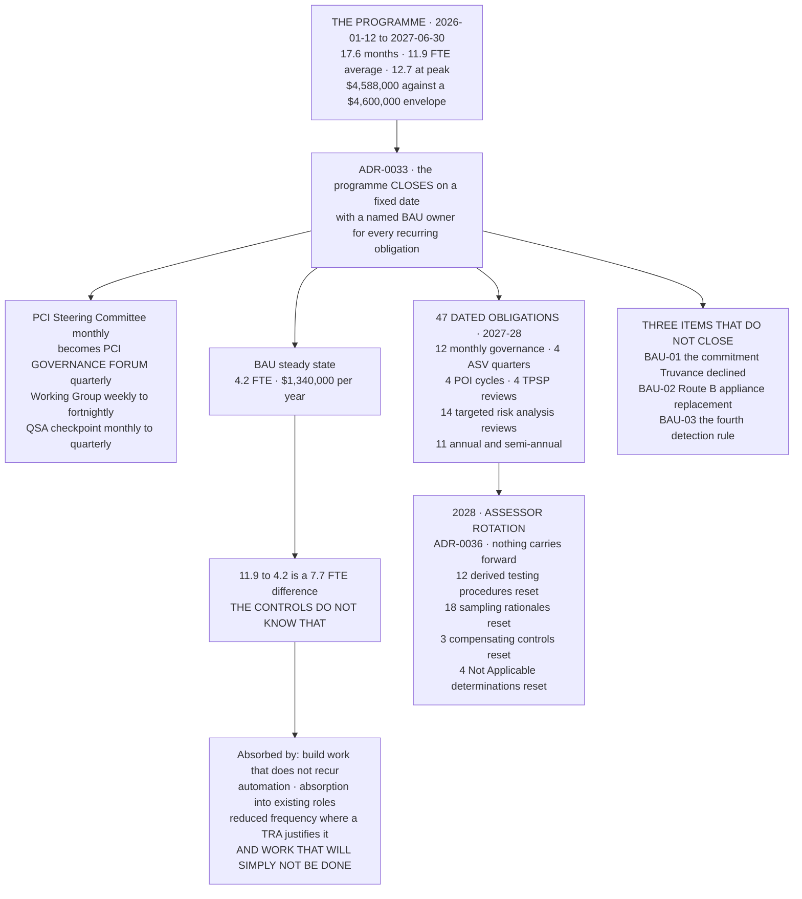

# From Programme to Business as Usual

## The number this diagram exists for

The programme ran at **11.9 FTE**. Business as usual is **4.2**. Some of that difference is real — build work does not recur, and several controls genuinely cost less to run than to construct. **Some of it is not**, and `09.08` names the obligations where the honest answer is that less will be done.

A transition document that shows only the savings is a business case. One that shows the residual is a handover.

## Source
`09.08-transition-to-business-as-usual.md`, `09.09`, `09.11`, `ADR-0033`, `ADR-0036`.
