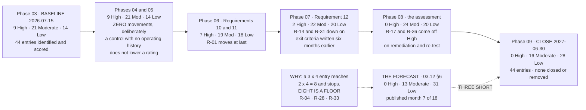

# The Register Across Eighteen Months

## The miss, and why it is in the diagram

**0 High · 16 Moderate · 28 Low** against a published forecast of **0 · 13 · 31**. Three entries short.

The forecast was written in **03.12 §6**, in month seven of an eighteen-month programme, and it moved thirteen entries from Moderate to Low without checking whether the register's own scoring discipline permitted it. **It does not.** A rating moves on likelihood unless the consequence itself changed, and a likelihood of 1 is reserved for events that are not reasonably foreseeable — so an entry scored **3 × 4** reaches **2 × 4 = 8** and stops. **R-04, R-28 and R-33 are all 3 × 4.** **R-17 and R-36** both arrive at **2 × 4**. **R-13 and R-15** reached Low although the forecast did not expect them to, and the reconciliation credits both.

The programme is reporting the forecast it published, not the one it could have written afterwards.

## Source
`09.12-the-final-risk-register.md`, `03.12`, `08.13 §6.3`.
