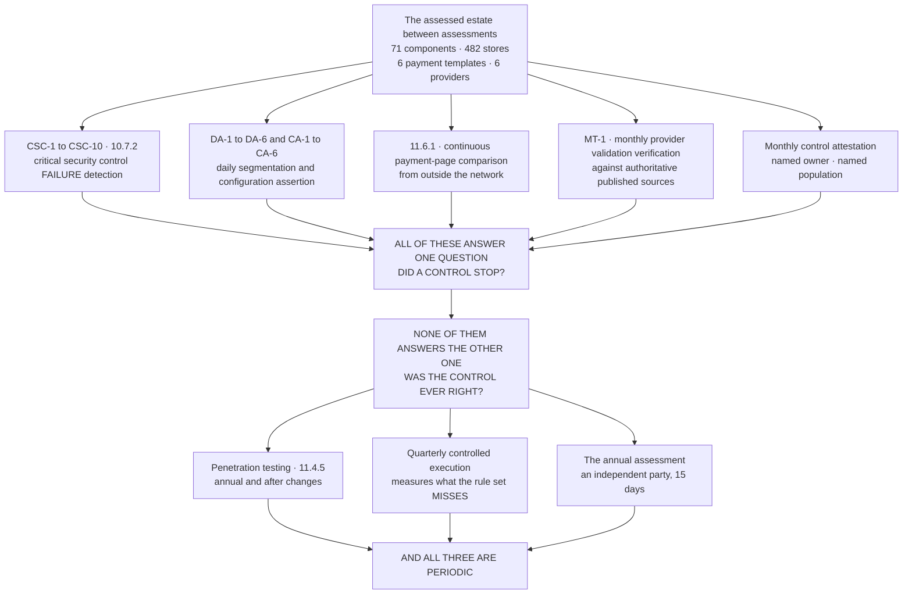

# Continuous Monitoring — What It Detects, and What It Cannot

## The failures on the record

Each mechanism has failed at least once in this programme, and the failures are the reason the diagram has a second half.

| Mechanism | Its recorded failure |
|---|---|
| Automated log review | **F-07** — a rule reporting itself healthy for **57 hours** while its source was stopped |
| Cloud logging assurance | **F-14** — found by CSC-7 detection rather than by anybody noticing an absence |
| Daily segmentation assertion | **F-18** — the assertion itself failed for four days, and was answered retrospectively against retained snapshots |
| Payment-page integrity | A vendor released a new version of an authorised script **before** the contractual notification arrived. 6.4.3 alone would have permitted it |

**A quarter with zero alerts is a defect to investigate, not a success** — ADR-0022, written in Phase 06 for exactly this reason.

## Source
`09.10-continuous-compliance-monitoring.md`.
