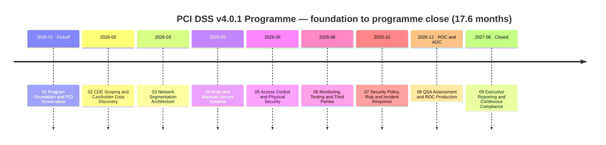
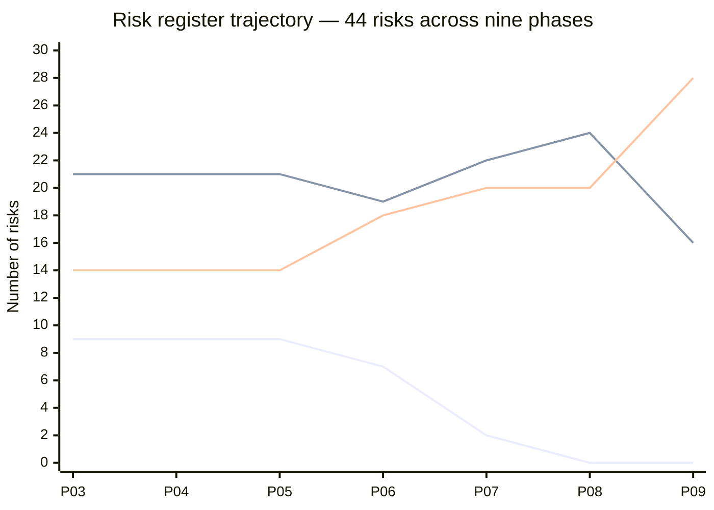

# Retail Chain — PCI DSS v4.0.1 Compliance Program

### 📊 [**View the Executive Dashboard →**](docs/DASHBOARD.md) &nbsp;·&nbsp; 🗂️ [Jump to full repository map](#️-repository-map--links-to-every-folder)

> An end-to-end, illustrative **PCI DSS v4.0.1 compliance programme** for a fictitious national specialty retailer — **Marketa Retail Group, Inc.** — taken from programme foundation through cardholder-data discovery, segmentation, control build, an on-site **QSA assessment producing a Report on Compliance and a non-compliant Attestation of Compliance**, remediation, re-assessment, and handover to continuous compliance. A **Level 1 merchant** at 68.4M annual card transactions, with 482 stores, a hosted-checkout e-commerce channel and a 310-agent call centre.
>
> **All names, data, figures and findings are fictional**, produced as a professional portfolio demonstration of payments GRC capability. Nothing here represents a real merchant, a real assessment, a real assessor or a real acquirer interaction.

---

## The one thing worth knowing about this portfolio

**Marketa told its acquirer it did not meet two PCI DSS requirements — twenty days before it had to tell it anything — and then met them.**

The 2026 Attestation of Compliance was filed with Cardinal Merchant Bank on **2026-12-11**, recording **8.6.2** and **11.3.1.2** as **Not in Place** with a remediation date of 2027-01-31. Both were remediated, a re-assessment on **2027-02-18** produced a compliant revised attestation — and **the non-compliant one was not withdrawn** ([ADR-0032](08-qsa-assessment-roc-production/adr/ADR-0032-the-2026-aoc-is-not-withdrawn.md)). Marketa's record shows both, in that order.

**Neither finding was discovered by the assessor.** Both were on Marketa's own register months before fieldwork — 8.6.2 from Phase 05 in June, 11.3.1.2 from Phase 06 in July — and in both cases a Compensating Controls Worksheet was drafted and **withdrawn rather than argued**. The assessor confirmed them.

And the register did the thing risk registers are not supposed to do. It **published a close forecast in month seven and missed it by three entries**, and the final phase publishes the arithmetic rather than the excuse:

> Under this register's own scoring discipline — a rating moves on **likelihood** unless the **consequence itself** changed, and a likelihood of 1 is reserved for events that are not reasonably foreseeable — **an entry scored 3 × 4 reaches 2 × 4 = 8 and stops. Eight is a floor.** The Phase 03 forecast moved thirteen entries across a boundary the arithmetic does not permit them to cross.

Two forecasts were published in advance and both were missed. [06.12 §7](06-monitoring-testing-third-parties/06.12-control-to-risk-traceability.md) predicted the two Not in Place risks reaching **Low** on remediation; [08.13 §6.3](08-qsa-assessment-roc-production/08.13-control-to-risk-traceability.md) records that it was wrong and warns the next phase. [09.12 §3](09-executive-reporting-continuous-compliance/09.12-the-final-risk-register.md) then reports the close at **0 High · 16 Moderate · 28 Low** against a published **0 · 13 · 31**.

**A register that only ever falls, and a forecast that is quietly restated as though it were met, are the two things that make a risk register worthless.** This portfolio does neither, and that is its spine.

---

## Programme at a glance

| Attribute | Value |
|---|---|
| Entity | **Marketa Retail Group, Inc.** — national specialty retail chain, privately held, Columbus OH |
| Merchant level | **Level 1** — 68.4M annual card transactions · annual on-site QSA assessment producing a **ROC** and an **AOC** |
| Size | **482 stores across 38 states** · 1,914 POS lanes · 4 distribution centres · ~34,000 staff (+6,800 seasonal Oct–Jan) · **$4.2B revenue** |
| Channels | Card-present 74% · e-commerce 23% (hosted checkout iframe) · MOTO 3% (310-agent call centre, DTMF masking) |
| Standard | **PCI DSS v4.0.1** — the first assessment with all **51 future-dated requirements** in force since 2025-03-31 |
| Scope | **1,842 systems → 604 believed in scope → 71 assessed** (8 CDE + 63 connected-to) — **−88.2%** via P2PE, tokenization and DTMF masking |
| Assessment | **306 applicable sub-requirements** · **297 In Place · 3 compensating controls · 4 Not Applicable · 0 Not Tested · 2 NOT IN PLACE** |
| Validation | **AOC Non-Compliant 2026-12-11** · remediated · **Compliant at re-assessment 2027-02-18** · **neither attestation withdrawn** |
| Independent testing | **19 penetration test findings (2 Critical / 5 High / 7 Medium / 5 Low)** — all remediated and **re-tested by the tester that found them** · first segmentation test **FAILED** · **Q1 ASV scan FAILED** and was reported to the acquirer as a failure |
| Risk | **44 risks** · baseline 9 High / 21 Moderate / 14 Low → close **0 High / 16 Moderate / 28 Low** — **three short of the published forecast, and 09.12 says why** |
| Cost | **$4,588,000** against a $4,600,000 envelope over **17.6 months** — **0.11% of revenue · $0.067 per card transaction** |
| Scale | **9 phases · 127 numbered documents · 319 markdown files · 37 Excel trackers · 30 diagrams · 36 ADRs · 27 templates · 27 governance records** |

*Lines, top to bottom at Phase 03: **Moderate** (21 → 16) · **Low** (14 → 28) · **High** (9 → 0). Phases 04 and 05 are deliberately flat — **a control published in July has no operating history**, and neither phase moved a single rating. Moderate **rises** at Phases 07 and 08 as High entries arrive from above, which is what an honest register looks like when risks come down one band at a time.*

---

## 🗂️ Repository map — links to every folder

Each phase is a top-level folder containing a numbered document set (`NN.00`–`NN.NN`) in execution order, plus six artifact sub-folders.

| Phase | Overview | 🖼️ Diagrams | 📈 Trackers (Excel) | 📝 Logs | 🏛️ Governance | 🧭 ADRs | 📋 Templates |
|---|---|---|---|---|---|---|---|
| **01 — Program Foundation &amp; PCI Governance** | [README](01-program-foundation-pci-governance/01.00-README.md) | [diagrams](01-program-foundation-pci-governance/diagrams) | [trackers](01-program-foundation-pci-governance/trackers) | [logs](01-program-foundation-pci-governance/logs) | [governance](01-program-foundation-pci-governance/governance) | [adr](01-program-foundation-pci-governance/adr) | [templates](01-program-foundation-pci-governance/templates) |
| **02 — CDE Scoping &amp; Cardholder Data Discovery** | [README](02-cde-scoping-cardholder-data-discovery/02.00-README.md) | [diagrams](02-cde-scoping-cardholder-data-discovery/diagrams) | [trackers](02-cde-scoping-cardholder-data-discovery/trackers) | [logs](02-cde-scoping-cardholder-data-discovery/logs) | [governance](02-cde-scoping-cardholder-data-discovery/governance) | [adr](02-cde-scoping-cardholder-data-discovery/adr) | [templates](02-cde-scoping-cardholder-data-discovery/templates) |
| **03 — Network Segmentation Architecture** | [README](03-network-segmentation-architecture/03.00-README.md) | [diagrams](03-network-segmentation-architecture/diagrams) | [trackers](03-network-segmentation-architecture/trackers) | [logs](03-network-segmentation-architecture/logs) | [governance](03-network-segmentation-architecture/governance) | [adr](03-network-segmentation-architecture/adr) | [templates](03-network-segmentation-architecture/templates) |
| **04 — Build &amp; Maintain Secure Systems** | [README](04-build-maintain-secure-systems/04.00-README.md) | [diagrams](04-build-maintain-secure-systems/diagrams) | [trackers](04-build-maintain-secure-systems/trackers) | [logs](04-build-maintain-secure-systems/logs) | [governance](04-build-maintain-secure-systems/governance) | [adr](04-build-maintain-secure-systems/adr) | [templates](04-build-maintain-secure-systems/templates) |
| **05 — Access Control &amp; Physical Security** | [README](05-access-control-physical-security/05.00-README.md) | [diagrams](05-access-control-physical-security/diagrams) | [trackers](05-access-control-physical-security/trackers) | [logs](05-access-control-physical-security/logs) | [governance](05-access-control-physical-security/governance) | [adr](05-access-control-physical-security/adr) | [templates](05-access-control-physical-security/templates) |
| **06 — Monitoring, Testing &amp; Third Parties** | [README](06-monitoring-testing-third-parties/06.00-README.md) | [diagrams](06-monitoring-testing-third-parties/diagrams) | [trackers](06-monitoring-testing-third-parties/trackers) | [logs](06-monitoring-testing-third-parties/logs) | [governance](06-monitoring-testing-third-parties/governance) | [adr](06-monitoring-testing-third-parties/adr) | [templates](06-monitoring-testing-third-parties/templates) |
| **07 — Security Policy, Risk &amp; Incident Response** | [README](07-security-policy-risk-incident-response/07.00-README.md) | [diagrams](07-security-policy-risk-incident-response/diagrams) | [trackers](07-security-policy-risk-incident-response/trackers) | [logs](07-security-policy-risk-incident-response/logs) | [governance](07-security-policy-risk-incident-response/governance) | [adr](07-security-policy-risk-incident-response/adr) | [templates](07-security-policy-risk-incident-response/templates) |
| **08 — QSA Assessment &amp; ROC Production** | [README](08-qsa-assessment-roc-production/08.00-README.md) | [diagrams](08-qsa-assessment-roc-production/diagrams) | [trackers](08-qsa-assessment-roc-production/trackers) | [logs](08-qsa-assessment-roc-production/logs) | [governance](08-qsa-assessment-roc-production/governance) | [adr](08-qsa-assessment-roc-production/adr) | [templates](08-qsa-assessment-roc-production/templates) |
| **09 — Executive Reporting &amp; Continuous Compliance** | [README](09-executive-reporting-continuous-compliance/09.00-README.md) | [diagrams](09-executive-reporting-continuous-compliance/diagrams) | [trackers](09-executive-reporting-continuous-compliance/trackers) | [logs](09-executive-reporting-continuous-compliance/logs) | [governance](09-executive-reporting-continuous-compliance/governance) | [adr](09-executive-reporting-continuous-compliance/adr) | [templates](09-executive-reporting-continuous-compliance/templates) |

---

## The nine phases, and what each one is actually for

| Phase | What it does | The thing worth reading it for |
|---|---|---|
| **[01](01-program-foundation-pci-governance/01.00-README.md)** | Merchant level, validation route, acquirer obligations **C1–C10**, charter, budget, RACI, calendar | **ADR-0004 makes a "Not Tested" disposition unavailable ten months before anybody knew which requirements would be uncomfortable** |
| **[02](02-cde-scoping-cardholder-data-discovery/02.00-README.md)** | Discovery across **1,842 systems, 41 shares, 6 email archives** · scope cut **604 → 71** | **Four unexpected PAN locations** — 11,400 call recordings, 2,187 dispute documents, a debug log, an emailed spreadsheet. **Two scope assumptions disproved, and R-31 raised on the evidence** |
| **[03](03-network-segmentation-architecture/03.00-README.md)** | Nine zones · the **44-risk register** and its scoring model · the segmentation penetration test | **The first segmentation test FAILED** at store 0417, latent at 37 stores. **R-14 raised 2026-05-18 with a 90-day exit criterion published before anyone knew whether it would be met** |
| **[04](04-build-maintain-secure-systems/04.00-README.md)** | Requirements 2–6 · **71 components across 6 baselines** · **6.4.3** payment-page script control | **38 scripts inventoried, 3 unauthorised.** The tag-console publication path was **removed rather than governed** — ADR-0011 |
| **[05](05-access-control-physical-security/05.00-README.md)** | Requirements 7–9 · **8.4.2 MFA across 20 access paths** · **1,914 POI terminals** | **The programme's only customized approach, at 8.3.9, delivered in full** — and **8.6.2 recorded Not in Place** after a compensating control was argued and refused |
| **[06](06-monitoring-testing-third-parties/06.00-README.md)** | Requirements 10–11 and 12.8 · **11.6.1** payment-page tamper detection · six providers | **R-01 finally moves** when the detective half of the script control exists. **Q1 ASV failed and was reported as a failure.** **11.3.1.2 recorded Not in Place** |
| **[07](07-security-policy-risk-incident-response/07.00-README.md)** | Requirement 12 · **14 targeted risk analyses** · **12.10.7** — PAN found where unexpected | **A tabletop designed by somebody who did not write the plan took 9h20m against an assumed 4**, and found that nobody had defined "determination" — the word the 24-hour clock runs from |
| **[08](08-qsa-assessment-roc-production/08.00-README.md)** | **15 days of QSA fieldwork** · the **741-page ROC** · the AOC · remediation · re-assessment | **Three of five recorded exceptions trace to one support agreement nobody had read as a security control.** The remediation **removed the finding, not the constraint** |
| **[09](09-executive-reporting-continuous-compliance/09.00-README.md)** | Board reporting · **34 measures** · **47 dated obligations** · programme close | **The close forecast is missed by three entries and the arithmetic is published.** One open item does not close **because a provider said no** |

---

## Numbers a reviewer can check

| Claim | Where it is evidenced |
|---|---|
| **306 = 297 + 3 + 4 + 0 + 2**, and per-requirement across all twelve | [08.05](08-qsa-assessment-roc-production/08.05-requirement-by-requirement-assessment-results.md) · `trackers/roc-disposition.xlsx` |
| **1,654 evidence artefacts = 1,284 + 228 + 47 + 61 + 34** | [08.04](08-qsa-assessment-roc-production/08.04-fieldwork-interviews-observations-walkthroughs.md) |
| **214 evidence requests = 186 (86.9%) from existing artefacts + 28 new production**, 0 unsatisfied | [08.03](08-qsa-assessment-roc-production/08.03-evidence-management-and-assessor-requests.md) |
| **Every risk movement's likelihood × impact equals its stated score**, in every phase | Each phase's `NN.12`/`NN.13` traceability document |
| **Seven impact reductions in eighteen months, all named** — R-10, R-14, R-31, R-23, R-08, R-18, R-32 | [09.12 §5](09-executive-reporting-continuous-compliance/09.12-the-final-risk-register.md) |
| **44 register entries at every position. None closed, none removed, none ever added** | [03.11](03-network-segmentation-architecture/03.11-risk-register.md) → [09.12](09-executive-reporting-continuous-compliance/09.12-the-final-risk-register.md) |
| **$4,588,000 against $4,600,000**, line by line | [09.04](09-executive-reporting-continuous-compliance/09.04-the-cost-of-compliance.md) |
| **47 calendar obligations = 12 + 4 + 4 + 4 + 14 + 11** | [09.09](09-executive-reporting-continuous-compliance/09.09-the-2027-28-compliance-calendar.md) |

**Every Excel tracker in this repository is generated by parsing the narrative markdown, with assertions on the counts.** The Phase 09 builder independently reconstructs all 44 register entries from the Phase 03 baseline and every recorded movement and asserts the closing position. **A workbook cannot drift from the prose, because it is derived from it.**

---

## The technical distinctions this portfolio gets right

| Distinction | Why it matters |
|---|---|
| **6.4.3 is preventive; 11.6.1 is detective** | Neither substitutes for the other. 6.4.3 alone permits an authorised script modified at its origin *after* deployment — and that is exactly what happened once. [04.10](04-build-maintain-secure-systems/04.10-payment-page-script-management.md) · [06.09](06-monitoring-testing-third-parties/06.09-payment-page-tamper-detection.md) |
| **Payment pages stay in scope for 6.4.3 and 11.6.1** even when the iframe is served from a third-party origin | The nuance most merchants miss about hosted checkout |
| **8.4.2 is not "MFA for admins"** | It is MFA for **all** access into the CDE. At Marketa that was **36 people who had never used a second factor**, not the 15 administrators who always had. [05.05](05-access-control-physical-security/05.05-authentication-and-mfa.md) |
| **Not Applicable ≠ out of population ≠ superseded** | 14 service-provider sub-requirements were **never in the 306**. 6.4.1 is **superseded** by 6.4.2, not N/A. Four merchant-applicable requirements are genuinely N/A and each was **tested rather than accepted**. [08.08](08-qsa-assessment-roc-production/08.08-not-applicable-and-superseded-determinations.md) |
| **A compensating control is a harder disposition, not a softer one** | Three were accepted and **two were refused**, on a test stated once and applied consistently. [08.07](08-qsa-assessment-roc-production/08.07-compensating-controls-worksheets.md) |
| **Under the customized approach, the entity does not write its own test** | Marketa supplied the Appendix E1 matrix; **Sable Ridge derived CTP-1 to CTP-12** at Appendix E2. It cost **51 assessor hours against an estimate of 46**, and carries **no forward assurance**. [08.06](08-qsa-assessment-roc-production/08.06-customized-approach-assessment.md) |
| **11.4.5 applies to merchants; 11.4.6's six-month cadence is service-provider-only** | A frequency an entity does not owe is a frequency it will eventually stop meeting |
| **PCI DSS is contractual, not statutory** | The Council writes the standard and **does not enforce it** — brands → acquirer → merchant. **There is no PCI DSS certification for a merchant**, and no attestation is a determination of compliance with any law |

**No fine, fee schedule or penalty amount appears anywhere in this repository.** Every figure quoted is a cost of assurance.

---

## The uncomfortable things, collected

A portfolio that only shows what went well is a portfolio about writing, not about compliance. These are on the record, in the phase that found them:

| What | Where |
|---|---|
| **The first segmentation penetration test failed**, latent at 37 stores | [03.07](03-network-segmentation-architecture/03.07-segmentation-penetration-test.md) |
| **Two risks were raised on evidence**, mid-programme, and both were given exit criteria in writing before anybody knew whether they would be met | [02.03](02-cde-scoping-cardholder-data-discovery/02.03-unexpected-pan-locations-and-response.md) · [03.11](03-network-segmentation-architecture/03.11-risk-register.md) |
| **Two compensating controls were argued and refused**, producing two Not in Place findings and a non-compliant attestation | [05.07](05-access-control-physical-security/05.07-application-and-system-accounts.md) · [06.05](06-monitoring-testing-third-parties/06.05-vulnerability-scanning.md) |
| **A quarterly ASV scan failed** and was reported to the acquirer as a failure rather than quietly rescanned | [06.06](06-monitoring-testing-third-parties/06.06-asv-scanning.md) |
| **An unauthenticated administrative interface sat open on a CDE component for 176 days** — and Marketa performed forensic enumeration of prior access rather than recording "no evidence of access" | [06.08](06-monitoring-testing-third-parties/06.08-application-penetration-test.md) |
| **Marketa was wrong about 1.2.8** on the assessor's second working day, and the correction is disclosed in the report | [08.04](08-qsa-assessment-roc-production/08.04-fieldwork-interviews-observations-walkthroughs.md) |
| **Three of seven proposed exclusions were refused** — *a policy prohibition is not a technical absence*, and *absence of use is not absence of the thing* | [08.08](08-qsa-assessment-roc-production/08.08-not-applicable-and-superseded-determinations.md) |
| **Two open items closed late and are reported as late**, by 34 and 40 days | [09.06](09-executive-reporting-continuous-compliance/09.06-open-items-and-corrective-actions.md) |
| **One open item did not close, because Truvance declined** a contractual response-time commitment — and it is not re-worded into something closable | [09.06](09-executive-reporting-continuous-compliance/09.06-open-items-and-corrective-actions.md) |
| **The close forecast was missed by three entries**, and the arithmetic is published | [09.12](09-executive-reporting-continuous-compliance/09.12-the-final-risk-register.md) |
| **The incident response plan has never handled a confirmed compromise.** One board measure is red and stays red — **R-43 has not moved in nine phases** | [09.01](09-executive-reporting-continuous-compliance/09.01-board-and-audit-committee-reporting.md) |

---

## 🧭 The 36 architecture decisions

The ADR series runs unbroken from **ADR-0001** to **ADR-0036** across all nine phases. Five shaped the outcome more than the rest:

| ADR | Decision | Phase |
|---|---|---|
| **[0004](01-program-foundation-pci-governance/adr/ADR-0004-no-not-tested-findings.md)** | **No "Not Tested" findings permitted** — taken in month one, before anybody knew which requirements would be uncomfortable | 01 |
| **[0011](04-build-maintain-secure-systems/adr/ADR-0011-remove-the-capability-not-govern-it.md)** | **Remove the capability, do not govern it** — the tag-manager publication path was deleted rather than controlled | 04 |
| **[0021](06-monitoring-testing-third-parties/adr/ADR-0021-evaluate-what-the-customer-received.md)** | **Evaluate what the customer received**, not what Marketa published — the gap where digital skimming lives | 06 |
| **[0031](08-qsa-assessment-roc-production/adr/ADR-0031-file-the-non-compliant-aoc-early.md)** | **File the non-compliant attestation early, not late** — twenty days ahead, with an honest Part 4 | 08 |
| **[0035](09-executive-reporting-continuous-compliance/adr/ADR-0035-the-scorecard-keeps-its-red-measure.md)** | **The board scorecard keeps its red measure** — a scorecard that goes all-green has stopped measuring something | 09 |

Full index: [Phase 09 ADR README](09-executive-reporting-continuous-compliance/adr/README.md).

---

## How to read this repository

**If you have five minutes** — read this page and the [Executive Dashboard](docs/DASHBOARD.md).

**If you have thirty** — read [08.00](08-qsa-assessment-roc-production/08.00-README.md) (the assessment), [09.12](09-executive-reporting-continuous-compliance/09.12-the-final-risk-register.md) (the register and the missed forecast), and [09.14](09-executive-reporting-continuous-compliance/09.14-programme-closure.md) (the close).

**If you are assessing the work itself** — pick any Excel tracker and any number in it, then find that number in the narrative document it was parsed from. They cannot disagree.

---

## Legal and framing notes

**PCI DSS is contractual, not statutory.** The PCI Security Standards Council writes the standard and does not enforce it; enforcement runs from the card brands to the acquirer to the merchant, and Marketa's counterparty is **Cardinal Merchant Bank, N.A.** **There is no PCI DSS certification for a merchant** — a Report on Compliance and an Attestation of Compliance are a **point-in-time attestation about an assessed period**, and no attestation is a determination of compliance with any law. A QSA's opinion binds neither an acquirer nor a card brand.

Marketa Retail Group is privately held, is not an SEC registrant, and has no SOX control population. **No fine, fee schedule or penalty amount is stated anywhere in this repository.**

Everything here is fictional and illustrative. The "Confidential — Cardholder Data Environment" classification lines exist for realism and mark nothing real.
