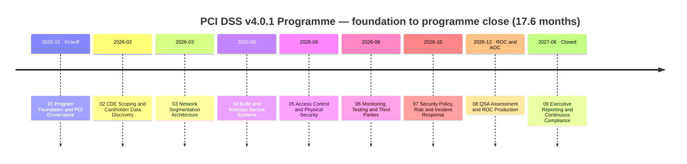
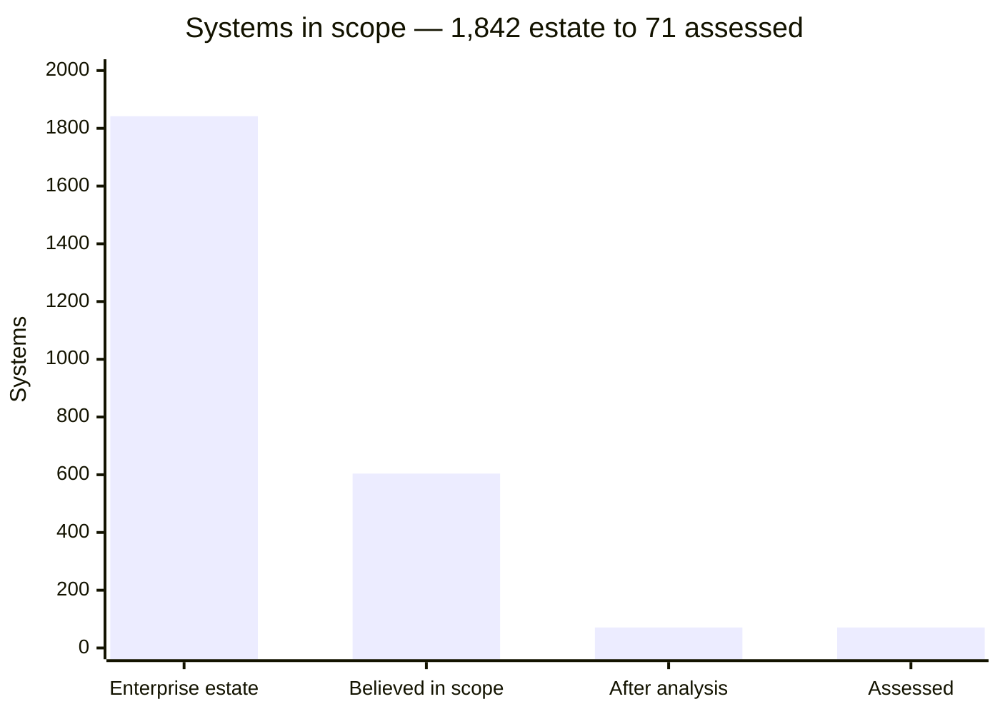
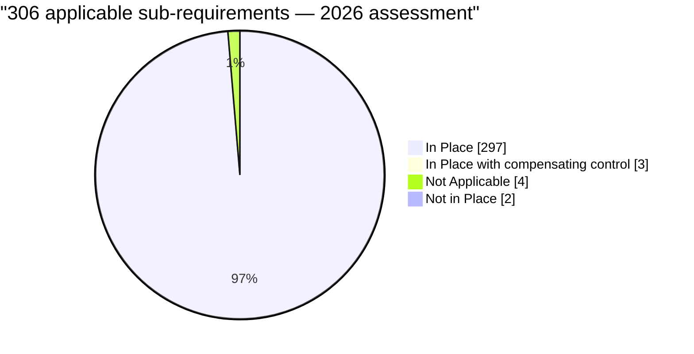
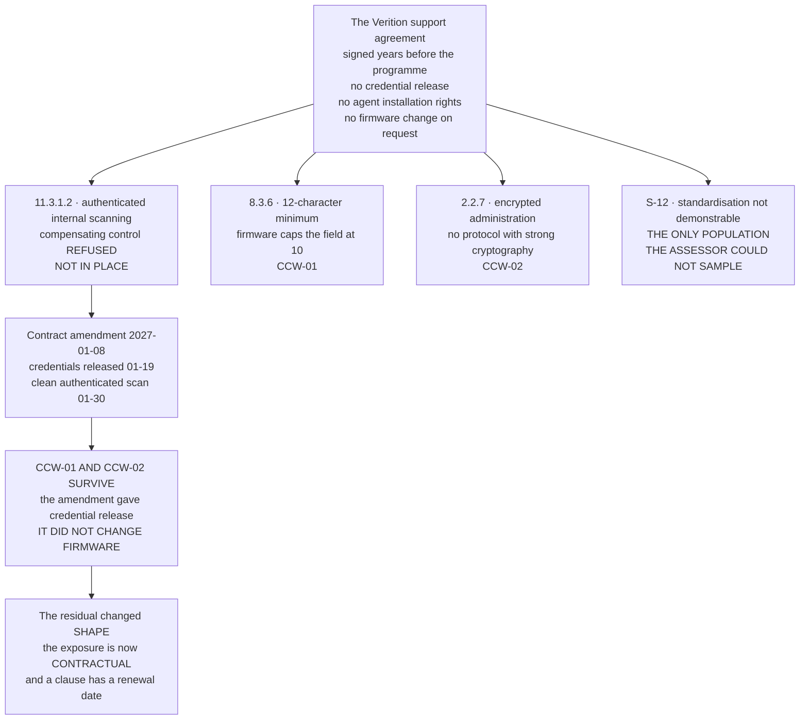
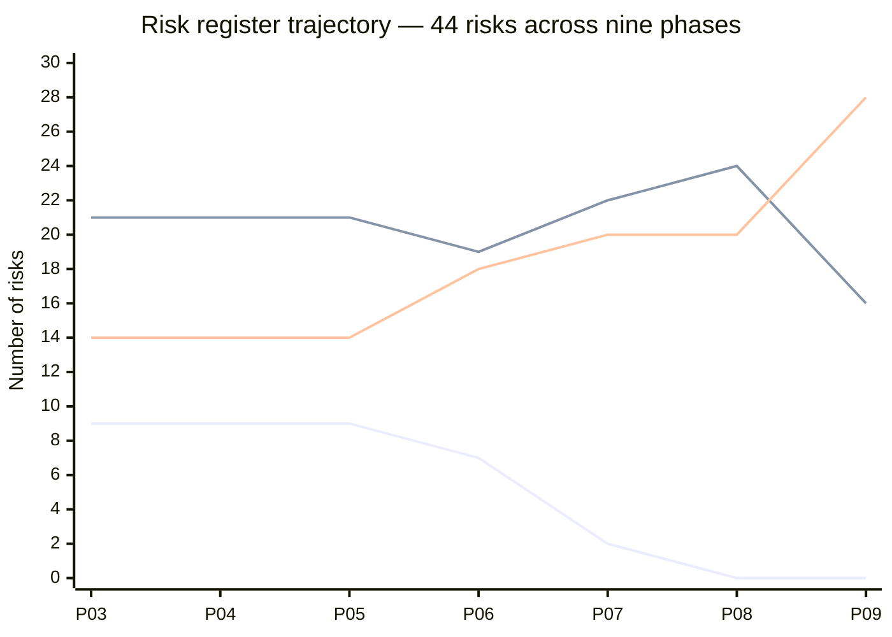
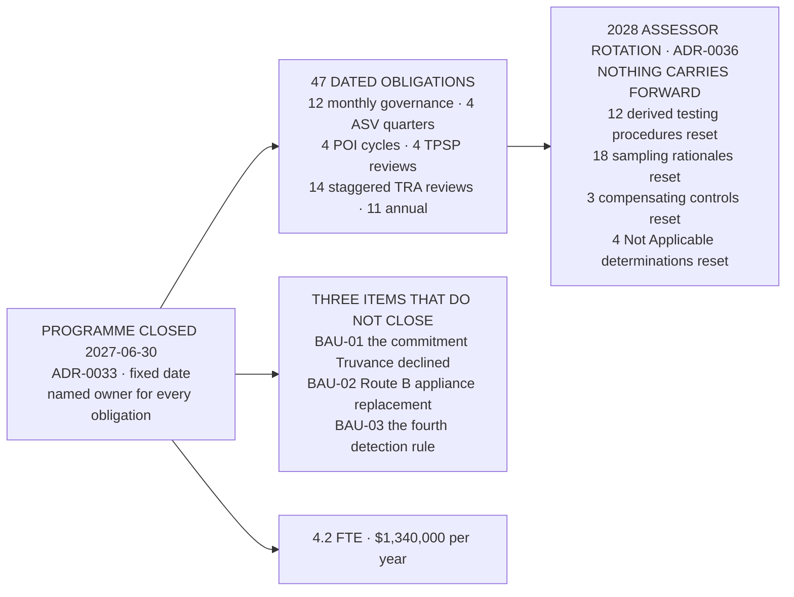

# 📊 Executive Dashboard — Marketa Retail Group PCI DSS v4.0.1 Programme

> **This page renders directly on GitHub** — the charts below are [Mermaid](https://github.blog/2022-02-14-include-diagrams-markdown-files-mermaid/) diagrams that GitHub draws inline, so the dashboard is visible with no setup.
> For the fully interactive version, open [`index.html`](index.html) locally or enable **GitHub Pages**.
>
> *Illustrative portfolio sample · "Confidential — Cardholder Data Environment" formatting for realism only · all names and figures fictional.*

---

## Programme scorecard

| Dimension | Result | Status |
|---|---|:--:|
| **Entity** | Marketa Retail Group, Inc. · **Level 1 merchant** · 482 stores · 38 states · ~34,000 staff · $4.2B revenue | 🟢 |
| **Scope** | **1,842 systems → 604 believed → 71 assessed** (8 CDE + 63 connected-to) · **−88.2%** | 🟢 |
| **Standard** | **PCI DSS v4.0.1** · first assessment with all **51 future-dated requirements** in force | 🟢 |
| **Assessment result** | **306 sub-requirements: 297 In Place · 3 CCW · 4 N/A · 0 Not Tested · 2 Not in Place** | 🟡 |
| **2026 Attestation** | **NON-COMPLIANT**, filed 2026-12-11 — **twenty days early**, with an honest Part 4 | 🔴 |
| **2027 re-assessment** | **COMPLIANT** 2027-02-18 · 299 · 3 · 4 · 0 · **0** · the 2026 attestation **not withdrawn** | 🟢 |
| **Who found the findings** | **Marketa did** — 8.6.2 in June, 11.3.1.2 in July, both months before fieldwork. **The assessor confirmed them** | 🟢 |
| **Penetration testing** | **19 findings (2C/5H/7M/5L)** · all remediated · **all re-tested by the tester that found them** · 18 closed first time, **1 at second** | 🟢 |
| **ASV scanning** | 4 quarterly cycles · **Q1 FAILED** and was reported to the acquirer as a failure · rescanned clean in 11 days | 🟡 |
| **Segmentation testing** | **First test FAILED** at store 0417, latent at 37 stores · re-test passed · second annual test **0 findings from Z3** | 🟡 |
| **Risk register** | 44 entries · baseline 9 High → **0 High · 16 Moderate · 28 Low** at close | 🟡 |
| **Against the published forecast** | Forecast **0 · 13 · 31** · actual **0 · 16 · 28** — **THREE SHORT**, and 09.12 publishes the arithmetic | 🔴 |
| **Open items at close** | 11 · **8 closed on time · 2 closed late · 1 NOT CLOSED — the provider declined** | 🟡 |
| **Assessor observations** | **17 · 11 adopted · 3 adopted with amendment · 3 declined in writing · 0 unanswered** | 🟢 |
| **Cost** | **$4,588,000** of a $4,600,000 envelope over 17.6 months · **0.11% of revenue** · **$0.067 per transaction** | 🟢 |
| **Incident response proved against a real compromise** | **NEVER HAPPENED.** 512 incident records · 5 SEV-2 · **0 SEV-1** · **R-43 has not moved in nine phases** | 🔴 |

**The two red lines are the honest headlines.** Marketa filed a non-compliant attestation, and its incident response capability has never been tested by the event it exists for. Both are stated on the board scorecard every quarter, and [ADR-0035](../09-executive-reporting-continuous-compliance/adr/ADR-0035-the-scorecard-keeps-its-red-measure.md) prevents the second from being retired as unmeasurable.

---

## The nine-phase journey

---

## Scope reduction — the number the whole programme rests on

| Mechanism | What it removes | What it costs |
|---|---|---|
| **P2PE** (Verition, validated solution) | 1,914 POS lanes and 482 store servers from the card-data path | **PIM adherence obligations**, and 1,914 terminals still in scope for 9.5.1 inspection |
| **Tokenization + hosted checkout iframe** (Truvance) | The e-commerce PAN path entirely | **Payment pages remain in scope for 6.4.3 and 11.6.1** — the nuance most merchants miss |
| **DTMF pause-and-resume masking** (Cadence) | 310 call-centre agent desktops | The masking service and telephony path stay in scope |

> **Scope reduction is not risk reduction.** The data still exists — it is held by somebody else. That caveat was written in Phase 02 and the bill arrives in Phase 06, where **six providers** operate most of the controls that make the reduction true and **three of them sit between Marketa and its ability to accept payment at all.**

---

## The assessment result

| Disposition | 2026-12-11 | 2027-02-18 | Detail |
|---|---|---|---|
| In Place | **297** | **299** | Including 8.3.9 by the customized approach |
| In Place with compensating control | **3** | **3** | CCW-01 (8.3.6) · CCW-02 (2.2.7) · CCW-03 (3.4.2) — **the count does not fall at re-assessment** |
| Not Applicable | **4** | **4** | 1.5.1 · 3.3.2 · 3.5.1.1 · 4.2.1.2 — **each tested, not accepted** |
| Not Tested | **0** | **0** | Prohibited by ADR-0004 **before the programme began** |
| **Not in Place** | **2** | **0** | **8.6.2** and **11.3.1.2**, both dated 2027-01-31 |
| **Attestation status** | **NON-COMPLIANT** | **COMPLIANT** | **Neither withdrawn** — ADR-0032 |

### Where the non-compliance actually came from

**Three of the five recorded exceptions trace to the same nine devices and the same support agreement.**

**One commercial decision produced more assessed exceptions than every control gap in the estate combined.** Not a compliance failure — a contract nobody had read as a security control.

---

## Risk register — the trajectory, and the forecast it missed

*Top to bottom at P03: **Moderate** · **Low** · **High**.*

| Position | High | Moderate | Low | Total |
|---|---|---|---|---|
| Baseline — Phase 03 | **9** | 21 | 14 | 44 |
| After Phase 04 | 9 | 21 | 14 | 44 |
| After Phase 05 | 9 | 21 | 14 | 44 |
| After Phase 06 | 7 | 19 | 18 | 44 |
| After Phase 07 | **2** | 22 | 20 | 44 |
| After Phase 08 | **0** | 24 | 20 | 44 |
| **At close — Phase 09** | **0** | **16** | **28** | **44** |
| **Published forecast — 03.12 §6** | **0** | **13** | **31** | **44** |
| **Variance** | ✔ | **+3** | **−3** | ✔ |

### Phases 04 and 05 moved nothing, and that is the point

Two consecutive phases delivered Requirements 2 through 9 and **moved zero ratings**, on a rule stated once and applied without exception: **a control published in July has no operating history, and operating history is what a rating moves on.** A register that fell every time a control was built would have reached zero High by August and meant nothing.

### The forecast, and why it was missed

> **Under this register's own discipline — a rating moves on likelihood unless the consequence itself changed, and a likelihood of 1 is reserved for events that are not reasonably foreseeable — an entry scored 3 × 4 reaches 2 × 4 = 8 and stops. Eight is a floor.**

| Line | Entries | Count |
|---|---|---|
| Forecast Moderate → Low, **delivered in Phase 06** | R-10, R-19, R-26, R-34 | 4 |
| Forecast Moderate → Low, **delivered in Phase 09** | R-08, R-18, R-21, R-22, R-23, R-32 | 6 |
| Forecast Moderate → Low, **not delivered** | **R-04, R-28, R-33** — all three **3 × 4** | **3** |
| Forecast High → **Low**, delivered to **Moderate 8** | **R-17, R-36** — both arrive at **2 × 4** | **2** |
| Not forecast to move, but reached Low | **R-13, R-15** | **+2** |
| **Net** | | **+3 → 16 Moderate** |

The forecast was written in **month seven of an eighteen-month programme**, before the scoring discipline had been tested against a single year of evidence. **Two forecasts were published in advance and both were missed** — [06.12 §7](../06-monitoring-testing-third-parties/06.12-control-to-risk-traceability.md) predicted R-17 and R-36 reaching Low, [08.13 §6.3](../08-qsa-assessment-roc-production/08.13-control-to-risk-traceability.md) corrected it and warned the next phase, and [09.12 §3](../09-executive-reporting-continuous-compliance/09.12-the-final-risk-register.md) reported the result.

### Seven impact reductions in eighteen months, all named

| Phase | Risk | Impact | The change in **consequence** that justified it |
|---|---|---|---|
| 06 | R-10 | 4 → 3 | A suspension rule recorded **in advance** |
| 07 | R-14 | 4 → 3 | The proved path ran **Z7 to Z5**, not into the CDE |
| 07 | R-31 | 4 → 3 | The historical corpus **destroyed and evidenced** |
| 09 | R-23 | **5 → 3** | The MOTO channel now **stops** rather than accepting unmasked |
| 09 | R-08 | 4 → 3 | Account data lands in a **quarantine**, not in a store |
| 09 | R-18 | 4 → 3 | **No privileged session exists** on the workstation to steal |
| 09 | R-32 | 4 → 3 | The exposure window is **bounded at 24 hours** |

**Impact has never been reduced as a way of moving a score that likelihood would not move.** Architecture changes consequences; operations change likelihood — which is why the final four months carry four of the seven.

---

## Independent testing — what an outsider found

| Engagement | Findings | Critical | High | Medium | Low | Outcome |
|---|---|---|---|---|---|---|
| Segmentation test — May 2026 | 8 | **1** | 2 | 3 | 2 | **FAILED.** Store 0417, latent at 37 stores. Re-test passed 2026-06-26 |
| Application test — September 2026 | 11 | **1** | 3 | 4 | 3 | Unauthenticated admin interface on a CDE component, **open 176 days** |
| **Programme total** | **19** | **2** | **5** | **7** | **5** | **All remediated. All re-tested by the tester that found them** — ADR-0020 |
| Second segmentation test — May 2027 | 6 | **0** | — | — | — | **0 findings reached from Z3** — R-27's return-to-High condition did not fire |

**Both Criticals were found by testers, not by Marketa**, and the portfolio writes it that way. On the second, Marketa performed **forensic enumeration of prior access** rather than recording "no evidence of access":

> *"'No evidence of access' obtained by not looking is not a finding. It is a sentence."*

---

## The assessment, in evidence

| Measure | Value |
|---|---|
| Fieldwork | **15 business days**, 2026-11-02 → 11-20 · Columbus, Austin, Ashburn and **28 stores** |
| Sampling | **18 populations** — 9 examined in full, 9 sampled · **the entity chose none of them** · store **0417 deliberately included by the assessor** |
| Evidence artefacts | **1,654** — 1,284 documents · 228 configuration examinations · **47 interviews across 39 individuals** · 61 observations · **34 independent assessor tests** |
| **Evidence requests** | **214 — 186 (86.9%) answered from artefacts that already existed** · 28 new production · 6 re-requested · **0 unsatisfied** |
| In-flight corrections | **9**, every one disclosed in the report as corrected during the assessment |
| Contested determinations | **4 — one went Marketa's way and three did not** |
| Report on Compliance | **741 pages · 1,654 evidence references** · factual review **31 comments, 24 accepted, 7 declined** |

**86.9% is the measurable payoff for seven phases of producing evidence as the work was done rather than for the assessment.** The 28 that required new production are point-in-time observations nobody can pre-produce — a live configuration read, a witnessed restore, a witnessed POI inspection.

---

## Cost of compliance

| Line | Budget | Actual | Variance |
|---|---|---|---|
| QSA assessment | $385,000 | **$429,000** | **+$44,000** — the re-assessment |
| ASV scanning | $28,000 | $28,000 | $0 |
| Penetration testing | $165,000 | $178,500 | +$13,500 |
| Security tooling | $1,240,000 | $1,193,000 | −$47,000 |
| Segmentation build | $890,000 | $967,000 | +$77,000 |
| Internal labour | $1,610,000 | $1,704,000 | +$94,000 |
| Training and awareness | $95,000 | $88,500 | −$6,500 |
| Contingency | $187,000 | **$175,000 drawn** | $12,000 unused |
| **Total** | **$4,600,000** | **$4,588,000** | **−$12,000** |

| Framing | Value |
|---|---|
| As a share of revenue | **0.11%** of $4.2B |
| Per card transaction | **$0.067** across 68.4M transactions |
| Per applicable sub-requirement | **$14,993** across 306 |
| **Business as usual** | **$1,340,000 per year · 4.2 FTE** against a programme average of **11.9 FTE** |

> The programme ran at 11.9 FTE and business as usual is 4.2. **The controls do not know that.** [09.08 §6](../09-executive-reporting-continuous-compliance/09.08-transition-to-business-as-usual.md) names the obligations where the honest answer is that **less will be done**, rather than that the same will be done more efficiently.

**No fine, fee schedule or penalty amount appears anywhere in this repository.** Every figure above is a cost of assurance.

---

## What business as usual inherits

**The 2026 assessment cost 51 assessor hours on one requirement because Marketa chose the customized approach. In 2028 that 51 hours is spent again, from zero, by somebody who has never seen the argument.**

---

## Programme scale

| Artefact | Count |
|---|---|
| Phases | **9** |
| Numbered documents | **127** |
| Markdown files | **319** |
| Excel trackers | **37** |
| Mermaid diagram documents | **30** |
| Architecture Decision Records | **36** — ADR-0001 to ADR-0036, unbroken |
| Governance records | **27** |
| Log documents | **36** |
| Templates | **27** |

**Every Excel tracker is generated by parsing the narrative markdown, with assertions on the counts.** Pick any number in any workbook and find it in the document it was parsed from — they cannot disagree.

---

## The honest close

Marketa Retail Group holds a **compliant** Attestation of Compliance dated 2027-02-18, and a **non-compliant** one dated 2026-12-11 that has not been withdrawn. Both describe the periods they describe.

Four things this programme does not claim:

**That compliance is a state.** It is a point-in-time attestation about an assessed period. There is **no PCI DSS certification for a merchant**, and the 2028 rotation resets the customized approach, all eighteen sampling rationales, all three compensating controls and all four Not Applicable determinations to zero.

**That the environment is secure.** An assessment tests controls against a standard; it does not test an environment against an adversary. **The programme's own instruments answered the second question and their answers were less comfortable.**

**That the incident response capability works.** It has never been tested by the event it exists for.

**That the register reached its forecast.** It did not — **0 · 16 · 28 against 0 · 13 · 31**, three entries short, with the arithmetic published rather than the excuse.

---

*Illustrative portfolio sample. **PCI DSS is contractual, not statutory** — the Council writes the standard and does not enforce it. All names, figures and findings are fictional.*

[🏠 Back to repository home](../README.md)
